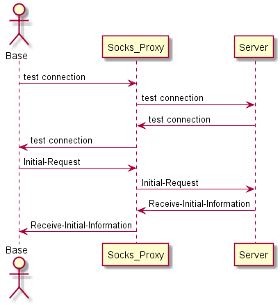
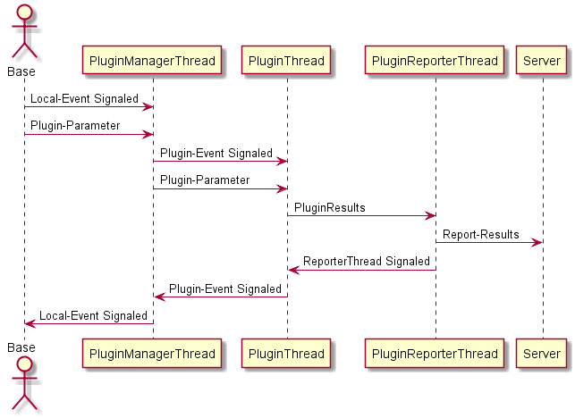
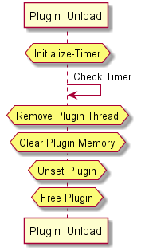

# IllusiveFog User-Documentation
# Documentation:

Documentations are divided into two parts:

*	User-Documentation
*	Developer-Documentation

---
#	Introduction:
IllusiveFog is designed for highly covert & stealthy operations,because of this
 reason features are kept limited and encryption is used to interact with c2,for
 every action there's a log,thus we've applied opsec checks at every interaction
 between c2 and mother(base implant).
 
 IllusiveFog is made to be highly focused on base framework itself(communication 
 between mother and c2,opsec checks and encryption).
 Techniques such as process-injection,shellcode process-injection or techniques that 
 risks losing opsec are avoided to  maintain opsec

---
# IllusiveFogFeatures/Plugins:

1.Persistence:- Install/Uninstall Persistence on Victim:
	
	-Dll-Hijacking:abuses Loading of missing DLLs(Dynamically Loaded Library) by  	
	Windows-Process,which results in Loading of an arbitrary DLL in that process. 
	Loading missing DLLs is feature,for application-compatability reasons these
	features are exploited for our use. 
	 
2:Data-Exfiltration:- Collect data from Victim's Machine:
	
	-ETW or Event Tracing for Windows is a feature that allows applications to
	collect logs about processes such as allocation of VADs,heaps,image load,
	network outgoing & incoming,disk,driver-load,process-creation,debug 
	prints,registry access and many other useful details.
	This feature is exploited to vital & rare intelligence about the 
	target.
	This feature not only allows one in a covert op to collect intelligence without
	risk of losing opsec but also use windows features more covertly.
	
	ETW-Providers subscriptions that enable to collect logs are also used by sysmon
	and windows defender (also known as ETW provider : Microsoft-Windows-Thread-
	Intelligence),mainly subscription to these ETW-Providers enable them to 
	collect logs about malicious activity,these ETW-Providers can be disabled so
	that windows-defender or sysmon will not receive any events about the process.
	Our research on usage and interaction between AV and ETW providers is in progress
	in-order to subvert these features for our benefit.
	Customer can expect updates on ETW plugin.
	 

3:Payload Loading:-	Inject Shellcode or Load a staged Payload on Victim Machine:
	
	-In any stealthy Operation need for using staged payload such as execution of
	raw byte-code(shell-code) or in memory execution of DLL (Dynamically Loaded 
	Libraries) or PE (Portable Executable) may arise,however we do not recommend 
	as it risks losing OpSec.many memory resident artifcats are left due to this.
	
	In-case of shellcode execution you may choose NO-RWX Plugin as it does not
	allocate Read-Write-Executable pages In-Memory.Note that execept for staging
	of DLL or PE,shellcodes are executed in IllusiveFog's process as it's much safer
	to just receive small peice of byte-code for execution rather than loading a
	huge blob of RWX paged memory.
	
	NOTE: shellcode MUST be FUD(Fully Un-detectable) as IllusiveFog will load it rather than staging it.
	
4:Shell:
	
	- Shell simply executes shell commands that are received,suspecious APIs
	such as WinExec/ShellExec are not used to maintain OpSec.you may use this to gain
	telemetry on victim's Machine,but commands are limited to OpSec-safe.

 5:Verbose-Recon: Gather more Information on Victim's Machine:

	- Verbose-Recon contains process of getting vital intelligence about 
	Victim's Machine In-Order to have better foot-hold over it such as telemetry
	to use vulnerability to gain higher privileges.
	It will collect data such as Mitigations that are enabled.
	reminder: add more to this
	   
6:EVTX: LogRemover
	
	- EVTX is the format of log record file which are placed in directory:
	"C:\Windows\System32\winevt\Logs",this plugin is responsible for clearing
	and event for a given EventRecordID,these event log files that contain 
	Events are responsible for growing up stack of events,all event logs are 
	collected in one file which poses threat to tampering EVTX files itself.
	
	A Read/Write handle to these EVTX files are taken to tamper these files.
	in-order to cleanly remove certain events,events are first exported then replaced
	in memory with EVTX files.
	WARNING: there maybe behavioural detections for referencing handle to EVTX files
	in modern EDRs.Thus in future a seperate EVTX parser will be provided
	which will be a kernel-mode module 

7:SelfSocks:socks5-Proxy
	
	-Victim's Machine is turned into socks5-proxy-server in-order pivot through 
	Victim's Machine or pass current network traffic to vicitim's Machine.
	WARNING: opening of port nortification by firewall may appear,in-order to 
	mitigate in future support for open-ssl certificates will be provided.
	

---
NOTE:THIS SECTION IS UNDER CONSTRUCTION WILL BE FINISHED AT THE END.
# 
IllusiveFog
 Configuration:
	Following are configurations for working of IllusiveFog
	
	1.socks5-proxy-server ip and port
	2.c2-server ip and port
	3.Location of c2-server directory to send intial request information
	4.4-intial post-request parameter,these are:
		A)User-name paramter
		B)Hardware-ID Parameter
		C)Windows Version Parameter
		D)Privilege level
	5.socks timer:timer to wait for receiving request from c2 server
	default:1-second
	6.Location of c2-server directory to send plugin results information
	7.Location of c2-server directory to Get Job requests
	8.Location of c2-server directory to Get plugins
	9.Plugin name which are configured on c2-server
	10.hex alias of plugins.
	11.hex alias of plugin-unload procedure.
---
NOTE:THIS SECTION IS UNDER CONSTRUCTION WILL BE FINISHED AT THE END.
# IllusiveFog Plugin-Arguments:
	Each Plugin Accepts parameters in-order to complete job based on it,
	In this section,Plugin-Arguments for parameters are detailed.
	
1.Shell:

	Shell Accepts shell command that needs to be executed,results for commands
	that are executed will be reported over c2 through a socks5-proxy-server
	example : shell whoami	

2.ETW:
	
	
	example : ETW 
	
3.

---

#	Working of IllusiveFog:
## Following are the procedures of IllusiveFog:
### A):IllusiveFogStartup: 
- Initialization
- Initialize-Information
- Initial-Request
- Initial-Request
- Receive-Initial-Information

### B):IllusiveFogCommunication:

- Principle of Communication
- Job Lookup
- Job Request

### C):IllusiveFog Plugin-Load
- IllusiveFog Plugin-Loading 
- Load-Plugin
- Set-Exports
- Create-Events
- Form-Parameters
- Launch-Thread
 			 
### D):IllusiveFog Plugin-Unload
- Initialize-Timer
- Check-Timer
- Plugin-Terminate
- Plugin-Clear
- Plugin-Unset
- Plugin-Free

---
# IllusiveFogStartup:  
### Initialization:
	 In order to establish communication with c2 server,IllusiveFog needs to initialize 
	 plugins,hex-plugin alias,and send initial request to c2 server.
	 Following are the procedure that IllusiveFog follows durin its initial stages:
	 
	 1: -Initialize-Information: information that are required by payload generator.
	 2: -Collect Initial-Information: Initial Information collected which are required to be sent to c2 server.
	 3: -Send Initial-Request:Send collected Information
	 4: -Receive-Information:Collect Information to establish further Communication with c2 server.
	 NOTE: if anything fails in during initial-stages,IllusiveFog will Exit its process and won't continue.

### Initialize-Information:
	
	During initial stages of IllusiveFog,it collects data which is written by the payload -generator,following are the data that is used to establish connection between IllusiveFog and c2-server:
	1): socket-ip: socks5-proxy server ip address
	2): socket-port: socks5-proxy server port
	3): destination-ip: c2-server ip address
	4): destination-port c2-server port
	5): Initial-Parameters  of following requests: 
		A):Parameter for user-name.
		B):Parameter for Hardware-ID.
		C):Parameter for Privilege-Level.
		D):Os Version.
	6):socks-timer: timer for each request made to c2-server.
	7):agent-Location:
		A):Agent-Info-Location: Location to send Initial-Information collected.
		B):Post-Request: Location of c2-server to send results of plugins.
		C):Get-Request: Location of c2-server to collect information for plugins.
		D):Plugin-Request: Location of c2-server to get pluguins
		E):Pellet-Request: Location of c2-server to get information for pellets to be loaded
		F):Pellet-Request: Location of c2-server to get pellets
		 	
	8):Plugin-Location:following names of plugin hosted on c2-server & their hex-alias are required:
		A):Shell-Plugin
		B):ShellCode-Plugin
		C):Load-Plugin
		D):EVTX-Plugin
		E)ETW-Plugin
		F)Verbose-Plugin
		G)Plugin-Unload command
		
	 
### Initial-Request:

	Inorder to establish connection with c2-server,information is collected about
	victim machine which are sent to c2-server,these information include:
	A):Hardware-ID 
	B):OS version
	C):username
	D):Privilege level of current process
	

### Receive-Initial-Information:
	
	Once Information about Victim's Machine is sent,following information is received 
	from c2 server for further communication:
	

	
	A):Agent-ID: A unique Identifier for each session of IllusiveFog
	B):Communication-Key:AES-128b-bit Key is received for further interaction with 
	server.
	C):Plugin-Key:AES-128-bit key is received to decrypt plugins(hosted on c2-server). 
	D):Pellet-Key:AES-128-bit key is received to decrypt pellets(hosted on c2-server).
	
Below Illustration represents IllusiveFogStartup Procedures:
		

	remainder: add details for "test-connection"
	1): Initially to confirm connection between socks-server and c2-server a request   	
	connection is sent through socks5-proxy-server to c2-server.If the connection 
	fails,Base or IllusiveFog waits for connects to bet successful.
	2): for Initial-Request IllusiveFog collects information from victim's machine (as 
	described above).
	3): Sends the Initial-Request through socks5-proxy-server to c2-server.
	4): Receives-Initial-Information to continue with further interaction with c2-
	server through socks5-proxy-server on the basis of received information (as 
	described above).   

---							
# IllusiveFogCommunication:
#### Principle of Communication:
	IllusiveFog Communicates to c2 by using AES-128 bit encryption on CBC mode and all 
	requests are done through a socks5 proxy-server
	

	remainder:addinfo about agent-ID
	1: -Job Lookup:Looks-up for jobs from c2.
	2: -Job Request-Receive: gets job and job-ID .
	3: -Job Request-Plugin:receives plugin from c2-server.
	4. -Proceed Plugin Request:verifies plugin request.
### Job Lookup:
	
	1. Once IllusiveFogStartup Task is done,IllusiveFog will keep sending GET request to c2
	server through socks5-proxy-server until it receives any Job.
	
### Job Request-Receive:
	
	Once c2 server issues any jobs,IllusiveFog will receive 
	following information:
	1.Job ID(base64 encoded,hex encoded and AES 128-bit - CBC encrypted).
	2.Plugin Alias (base64 encoded,hex encoded and AES 128-bit - CBC
	encrypted).
	3.Plugin Parameter(base64 encoded,hex encoded and AES 128-bit - CBC
	encrypted).

### Job Request-Plugin:

	A):In order to feed this information to IllusiveFog,it will base64-decode,
	hex-decode & decrypt AES 128-bit CBC encrypted Job request
	B):IllusiveFog stores Job ID in-memory
	C):IllusiveFog picks up decrypted Plugin-Alias
	

### Proceed Plugin Request:
reminder: check plugin verification in IllusiveFog

	In-order to proceed with plugin verification process IllusiveFog checks in current 
	job-request for following things:
	1): Plugin Alias:If Plugin Alias matches it will proceed ahead
	2): Plugin Parameter: it will copy clear plugin parameter(term "clear" is used 
	in-order to add a note to remove padding caused due to AES-CBC 128bit encryption)
	3): Job-ID:Each plugin task is assigned a Job-ID,this Job ID is sent to server
	when a plugin task is completed.
	4): Plugin-Pellets: this is boolean,for certain plugins pellets are enabled
	WARNING: if IllusiveFog fails to verify plugin,or an unknown Plugin Alias is issued
	from c2-server,it will not proceed with plugin-loading process.
	5): Plugin request page is selected according to configuration passed in by 
	Payload-Generator for particiular plugin.
	6): sends download in-memory request to plugin-page which is encrypted and hosted
	on c2-server.
	7): Decrypts(base64 encoded,hex encoded and AES 128-bit - CBC
	encrypted) plugin in-memory and passes plugin to IllusiveFogPlugin 
	Procedure for completing task assigned in the job.
	
below shows an illustration of IllusiveFogCommunication:
		
	
	Once communication is established (IllusiveFogStartup is finished),to c2-server
	a loop is created which sends request to c2-server through 
	socks5-proxy-server,If request contains job,it will break.
	following steps will be following to proceed ahead:
	1):Once job Request is Received, Job ID ,Plugin Parameters are extracted from
	job buffer.(read Job-Request Recevie).
	2):job buffer contains plugin-alias to be loaded,which will parse with IllusiveFog
	and pick up its particular page from configuration(read Job Request-Plugin &  
	Proceed Plugin Request). 
	3):Encrypted Plugin is received from plugin-page from c2-server through socks5-
	proxy-server.
	4):Plugin is Decrypted and passed to IllusiveFogPlugin Procedure.
	 

---
#	IllusiveFogPlugin:
### IllusiveFog Plugin-Loading:
	IllusiveFog has unique mechanism to perform inter-thread communication with plugin,
	following are the steps in which IllusiveFog Loads and pass parameters to its Plugins.
	
	1.Load Plugin: Load Plugin in memory.
	2.Set Export: Set Exports of Plugin
	3.Create-Event: Create an Event for Plugin export Function.
	4.Create-Event: Create an Event for Plugin Reporter Thread.
	5.Create-Event: Create an Event for plugin manager Thread.
	6.Form-Parameters:Form Parameters for plugin,note:these parameters will be passed through inter-thread communication mechanism
	
	7.Launch-Thread: launch reporter thread and reporter event as parameter to thread.
	8.Launch-Thread: launch plugin export function as thread and pass Event for plugin export function as parameter.
	9.Launch-Thread: plugin manager thread and pass plugin parameter. 
	10.Launch-Thread: plugin manager to pass plugin parameter. 

### Load-Plugin:
		
	Plugins are in the form of DLL(Dynamically Loaded Libraries),
	Once plugin is decrypted in memory,IllusiveFog will procede with following steps:
	1.Copy Sections of plugins in memory (sections such as .text,.bss).
	2.Form delta from base address,
	3.Form Import Table of plugin.
	4.Relocate Address of Plugins.
	5.Get Export Address of function in plugin			

### Set-Exports:
	
	Once Plugin is loaded,in order to prepare or set it's export functions from Export Address table,IllusiveFog will hold  base address of Plugin and set export address function to a type-defined function of plugin.

### Create-Events:
	
	Event:Events are objects in memory,which are used as signals in thread,
	An Event is generated and passed as parameter for following Threads:
	
	A):Plugin Thread:Plugin Thread is the export address of function of plugin
	
	B):Reporter Thread:Reporter Thread:Reporter Thread is responsible for getting results for Plugin Thread and reporting to c2.
	
	C):Plugin Manager Thread:Plugin Manager Thread is responsible for passing parameters to Plugin Thread,it will also wait for job to be completed.
	
		
### Form-Parameters:

	Parameters for plugin-thread and reporter-thread are required to be formed for inter-communication between both the threads.
	Following parameters are passed to Plugin-Thread:
	A):Reporter-thread Event:
	Inorder to signal threads between plugin-thread and reporter-thread a common reporter event is passed to both threads.
	
	B):Reporter-thread ID:
	Inorder for plugin-thread to report to reporter-thread,thread ID is required.
	
	C):Plugin-Parameter:
	Plugin-Parameter to plugin for it to perform actions based on parameters.
	
	D):Plugin-Event:
	Plugin-Manager Thread uses Plugin-Event to signal threads between Plugin-Manager and Plugin-Thread.
	
	E):Local-Event:
	local Events created to signal threads between Main-Thread of IllusiveFog and Plugin-Manager Thread.
	
	F):[OPTIONAL]:Pellets:
	if a Plugin is Pellet-enabled,then pointer to Agent-ID and pellet key is be passed.
	
### Launch-Thread:

	After Loading Plugin,Setting Plugin's Exports,Creating Events and Formation of Parameters,Following Threads are Launched:
	A):Plugin-Thread(Export Function of Plugin) 
	B):Plugin-Manager Thread (responsible for passing parameters to thread)
	C):Reporter-Thread:(responsible for reporting results back to c2)
	
	Note:Local Event is passed as parameter to Plugin-Manager Thread for main-thread
	to signal thread and communicate  with Plugin-Manager Thread.
	
below is a short-illustration and detailed explaintation of passing  a parameter to plugin:
	

	remainder: use term "thread parameters" to be more specific
	1. detailed explaintation for above illustration:
	Once a Plugin is loaded,a Plugin-Event is passed to Plugin Export Function thread,Reporter Event is created which is passed to Reporter Thread and finally a Local-Event is created which is passed to Plugin-ManagerThread.
	
	2. The base or IllusiveFog,waits for Local-Event to be signaled,Once signaled it will pass Plugin-Parameters (which are discussed above) through Inter-Thread-Communication mechanism to PluginManager-Thread.
	
	3. Once parameters are passed to Plugin-Thread PluginManager-Thread will wait for Plugin-Thread to be signaled,once signaled it will pass parameters received from Base or IllusiveFog to PluginThread through Inter-Thread-Communication mechanism.
	
	4. Finally PluginThread will complete its job on the basis of plugin parameters passed.
	
	5.PluginThread will wait for ReporterEvent to be signaled and pass Plugin report or results to Reporter-Thread through Inter-Thread-Communication mechanism.
	
	6.Reporter-Thread will report the results to server. 	  
	 	  

# IllusiveFog Plugin-Unload:
 Plugins in IllusiveFog are unloaded either by command from c2-server or automatically 
 every 10 minutes,following describes how plugins are unloaded in IllusiveFog:
 
	1):initialize-Timer:Initializes a waitable timer
	2):Check-Timer:Check for if waitable timer is signaled
	3):Plugin-Terminate:Removes plugin Threads.
	4):Plugin-Clear:clear plugin memory
	5):Plugin-UnSet:UnSet Plugin in memory
	6):Plugin-Free:Unload Plugin  		
### Initialize-Timer:
	
	A waitable timer is initialized for each plugin that is loaded,these timers are 
	signaled after 10-minutes.
	  
### Check-Timer:

	If the timer is signaled for the plugin,IllusiveFog will check if the plugin is 
	already unloaded due to c2-command(job issued by c2-server) passed in,if not,it 
	will commence with unloading of plugin.
### Plugin-Terminate:

	If a plugin needs to be unloaded,Following threads related to plugin will be
	terminated before clearing any memory related to plugin:
	A):Plugin-Thread:Export Address function of plugin
	B):Plugin-Manager Thread:Thread that is responsible for passing parameter to 
	Plugin-Thread 	
	Reminder:check for plugin-reporter thread.
	C):Close handle to PluginEvent
	D):Close handle to Plugin-Manager Thread Event
	
### Plugin-Clear:
	
	This Operation is performaed only after threads related to plugins are 
	terminated.
	This Operation is responsible for clearing following objects related to plugin:
	A):Plugin-Thread ID	
	B):Plugin-Manager Event
	C):Plugin-Thread Event

	D):Plugin-Manager thread 	 
	handle
	E):Plugin-Thread Handle
	F)Plugin-Event
	D)Plugin Timer(Timer is reset when plugin is loaded once again).
		
### Plugin-Unset:
	
	Following Memory Addresses related to Plugin are unset in IllusiveFog:
	A)Allocated Base Address of Plugin.
	B)Address of export function of Plugin.

### Plugin-Free:
	
	if threads,events,handles related to given plugin are cleared/removed,
	Plugin's memory region or Allocated Base Address is freed.
	resulting into a clean unloading operation for a given Plugin.
below shows an illustration for Plugin-Unload:
	

	When a particular plugin is loaded,a waitable timer of about 10-minutes is issued
	by IllusiveFog for that plugin(meaning each plugin are issued with their own waitable 
	timer),when a plugin unload is either by c2-server or waitable timer being 
	signaled,following steps are followed to completely unload plugin:
	
	A):For a particular plugin,A Plugin-Thread,Plugin-Manager-Thread and Reporter-
	Threads are created for its working,these threads are terminated.
	B):Plugin-Thread-ID,Plugin-Reporter-Thread and Plugin-Thread are removed.
	C):Export-Address-Function of plugin is removed.
	D): Plugin is freed from memory.
	 		
	 Thus,resulting in clean removal of plugin from memory.		

